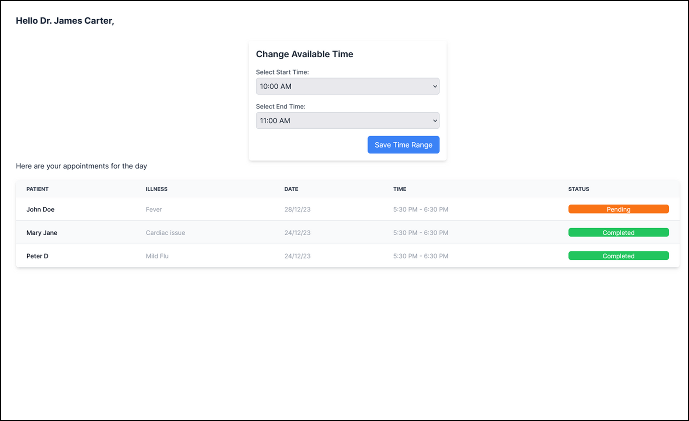

This is our submission for the Appian hackathon

## Getting Started

First, run the development server:

```bash
npm run dev
# or
yarn dev
# or
pnpm dev
# or
bun dev
```

Open [http://localhost:3000](http://localhost:3000) with your browser to see the result.

## The system design


## The UI screens

### UI for employees


### UI for Clients


### UI for medical practitioners


